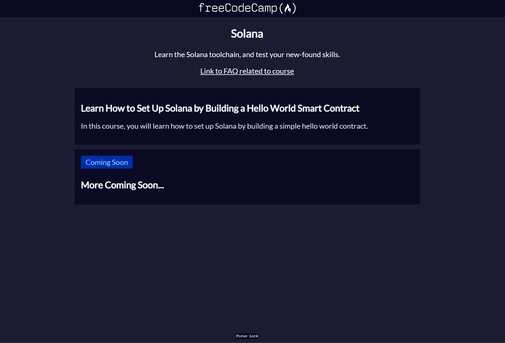
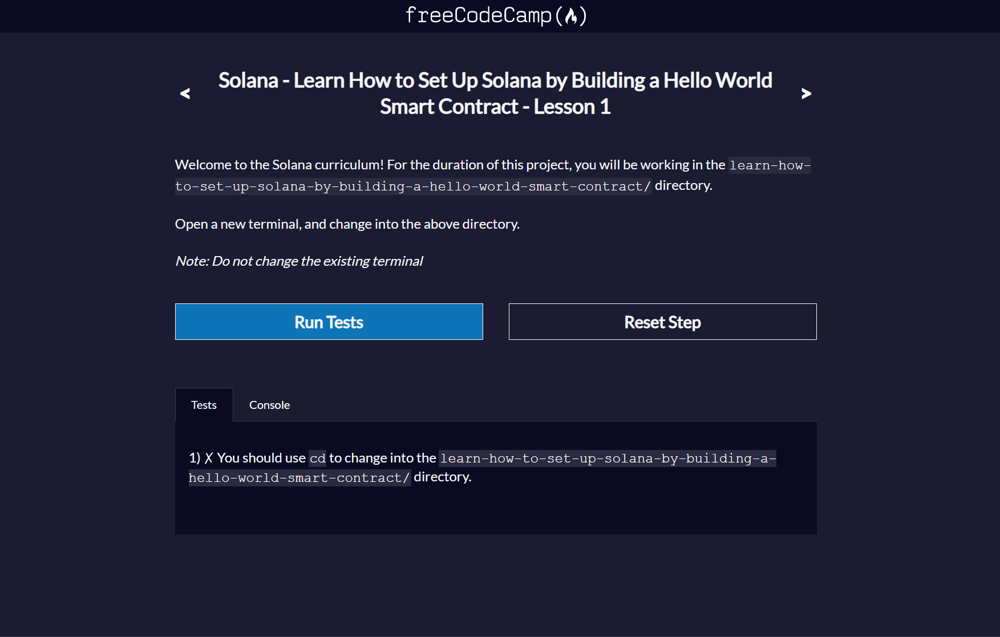

# freeCodeCamp - Courses

<!-- TODO: Add link to potential page with course descriptions/images -->

This extension helps run the freeCodeCamp courses found here: [./resources/courses.json](resources/courses.json)

**NOTE TO COURSE CREATORS:** To be used in conjunction with [freeCodeCampOS](https://github.com/freeCodeCamp/freeCodeCampOS).

## Features

### How to Open A Course

1. Press `Ctrl + Shift + P` and select `freeCodeCamp: Open Course`

3. Select a course from the list

4. `Ctrl + Shift + P` and select `Remote-Containers: Rebuild and Reopen in Container`

5. `Ctrl + Shift + P` and select `freeCodeCamp: Run Course`

---

## Creating a Course

See https://opensource.freecodecamp.org/freeCodeCampOS/

### Basic Config File

See up-to-date example here: [./src/fixture.ts](src/fixture.ts)
