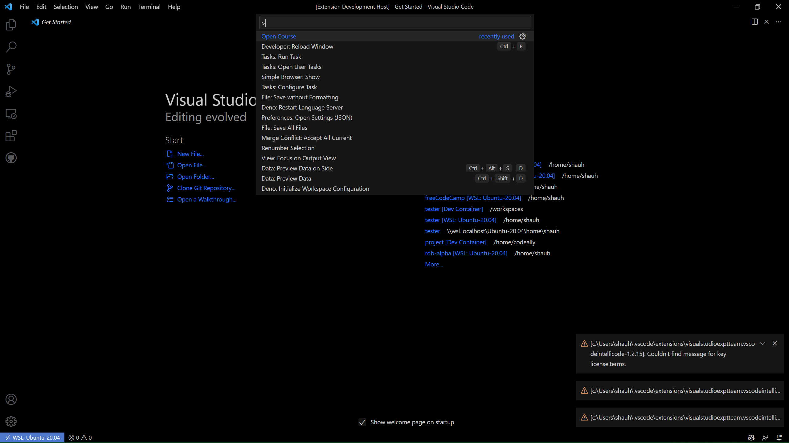
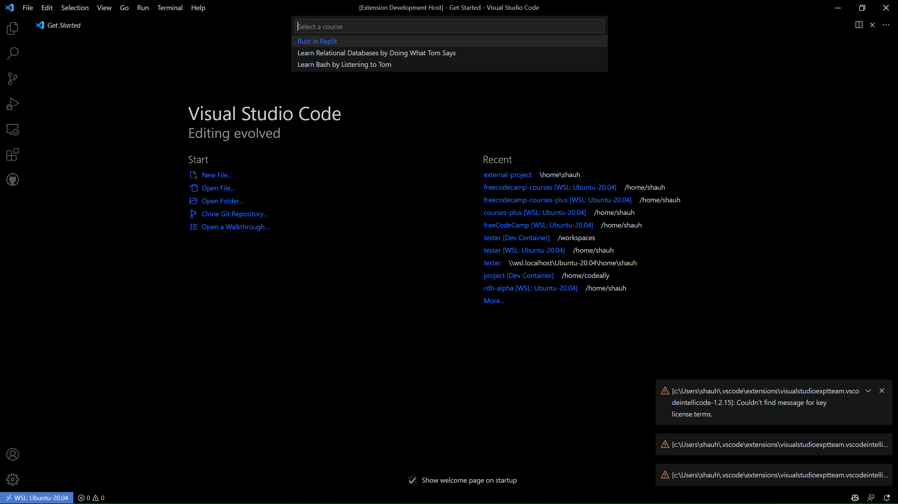
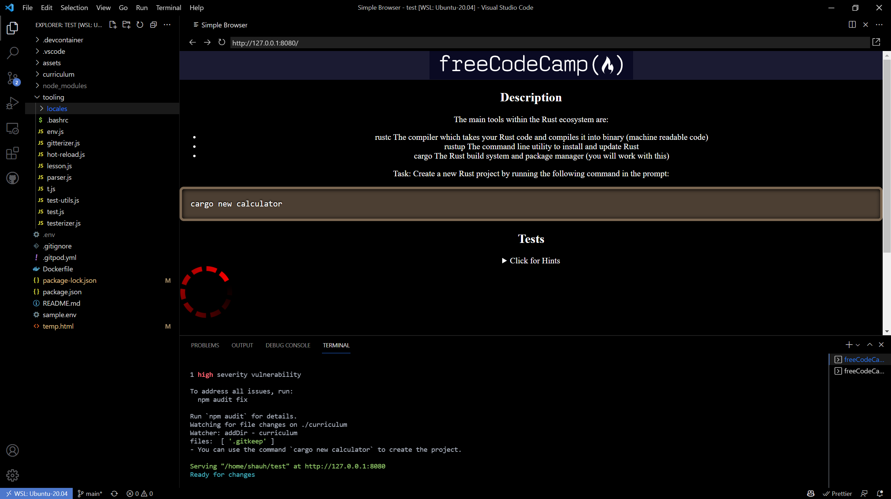

# freeCodeCamp - Courses

<!-- TODO: Add link to potential page with course descriptions/images -->

This extension helps run the freeCodeCamp courses found here: [./resources/courses.json](resources/courses.json)

## Features

### How to Open A Course

1. Press `Ctrl + Shift + P` and select `freeCodeCamp: Open Course`



3. Select a course from the list



4. `Ctrl + Shift + P` and select `Remote-Containers: Rebuild and Reopen in Container`

5. `Ctrl + Shift + P` and select `freeCodeCamp: Run Course`



---

## Published Courses

- [Project Euler: Rust](https://github.com/freeCodeCamp/euler-rust/)

## Course Config

Create a `freecodecamp.conf.json` file somewhere within the workspace.

### Basic Config File

See up-to-date example here: [./src/fixture.ts](src/fixture.ts)

```js
// This should be in JSON
const exampleConfig = {
  bashrc: {
    // The .bashrc file to be sourced
    enabled: true, // Whether or not to source .bashrc file
    path: "./.freeCodeCamp/.bashrc", // Relative path to .bashrc file
  },
  path: ".freeCodeCamp", // Relative path to tooling directory where scripts will be run
  prepare: "npm ci",
  scripts: {
    // Scripts linked to extension commands
    "develop-course": "npm run develop", // Run when `Develop Course` command is executed
    "run-course": "npm run start", // Run when `Run Course` command is executed
    test: {
      // Run when `Test` command is executed
      functionName: "handleMessage", // Name of the function to be called
      arguments: [
        {
          message: "Hello World!",
          type: "info",
        },
      ], // Arguments to be passed to the function
    },
  }
  workspace: {
    // Workspace settings
    files: [
      // Files to be opened in workspace
      {
        path: "README.md", // Relative path to file
      },
    ],
    previews: [
      // Previews to be opened in workspace
      {
        open: true, // Whether or not to open preview
        showLoader: true, // Whilst packages are being installed, show loader
        url: "https://www.freecodecamp.org/", // URL to open
        timeout: 10000, // Timeout for loading URL
      },
    ],
    terminals: [
      // Terminals to be opened in workspace
      {
        directory: ".", // Relative path to open terminal with
        message: "'Hello World!'", // Message to display in terminal
        name: "Camper", // Name of terminal
        show: true, // Whether or not to show terminal
      },
    ],
  },
};
```
